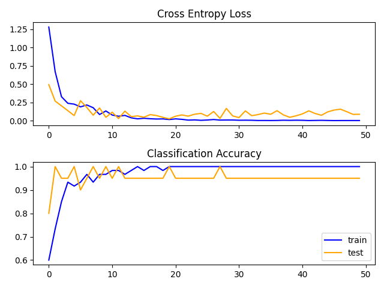
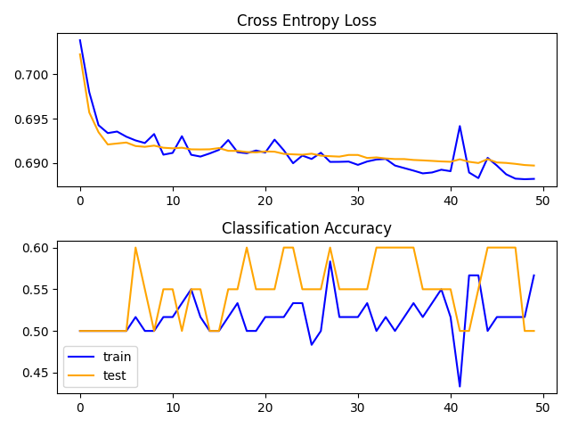
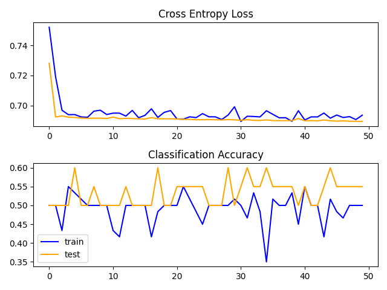
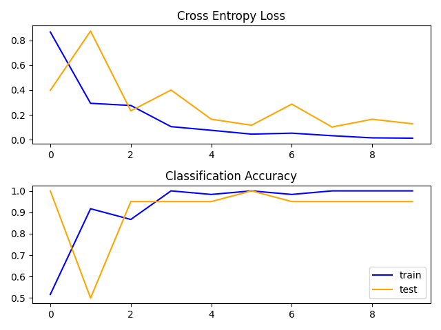
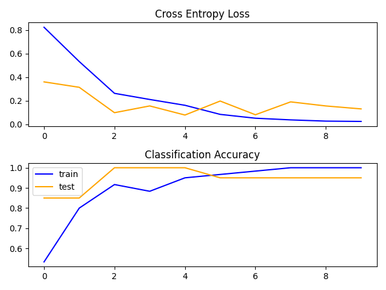

# Q1

## 1. Baseline CNN

Implemented VGG3 CNN as a baseline model

Validation Accuracy: 0.95

## 2. Transfer learning with VGG1

Transfer the learing from the VGG1 model. Here we use the learned weights from the already trained model and just train the dense layers to get the predictions on VGG1.

Validation Accuracy: 0.50

## 3. Transfer learning on VGG1 with data augmentation

Augmented the data using:

* `width_shift_range=0.1`
* `height_shift_range=0.1`
* `horizontal_flip=True`

Validation Accuracy: 0.55

## 4. Transfer learning with VGG16

Transfer the learing from the VGG16 model. Here we use the learned weights from the already trained modeland just train the dense layers to get the predictions on VGG16.

Validation Accuracy: 0.95

## 5. Transfer learning on VGG16 with data augmentation

Augmented the data using:

* `width_shift_range=0.1`
* `height_shift_range=0.1`
* `horizontal_flip=True`

Validation Accuracy: 0.95

* From the above results we can observe that the transfer learning of VGG16 gave similar accuracy as the baseline, as the used model of VGG16 had already benn trained on the ImageNet dataset which is a classification dataset. 
* While in VGG1 we can observe that the accuracy is moderate as the weights are not trained on a classification dataset and we are just training the dense layers with our data. 
