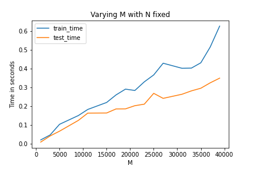
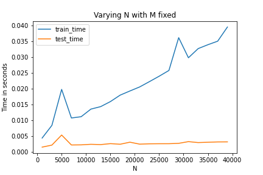

# Q2

## Results:

Theoretical Time Complexities:
training time: O(N*D)
testing time: O(D)

Plot for training and testing times with varying M and N fixed:

Conclusion:
* We observe that since we have kept N constant and are varying D, the graph obtained for training time is along the lines of the theoretical time complexity O(N*D) since N is constant and the graph is increasing almost linearly with increasing D (M).
* Similarly, the testing time is also along the lines of the theoretical time complexity since the time is increasing almost linearly with increasing D (M).
* We observe that, the training time here is more than testing time. This is also along the theoretical complexities as that of training is O(N*D) and that of testing is O(D) which is clearly less than that of training because of the extra N.

Plot for training and testing times with varying N and M fixed:

Conclusion:
* We observe that since we have kept M constant and are varying D (M), the graph obtained for training time is along the lines of the theoretical time complexity O(N*D) since D is constant and the graph is increasing almost linearly with increasing N.
* Similarly, the testing time is also along the lines of the theoretical time complexity since the time is almost constant and independent of N as followed from the theoretical time complexity O(D).
* We observe that, the training time here is more than testing time. This is also along the theoretical complexities as that of training is O(N*D) and that of testing is O(D) which is clearly less than that of training because of the extra N.