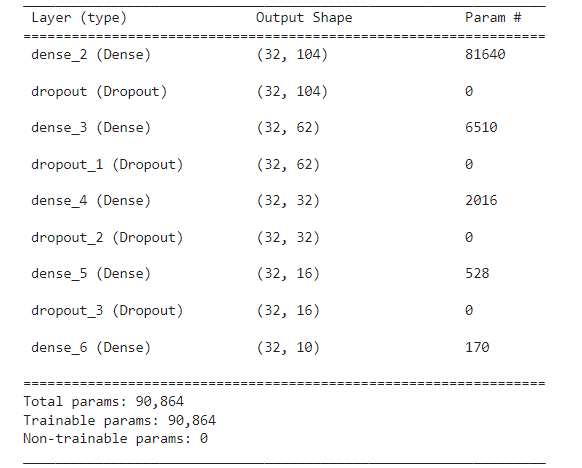
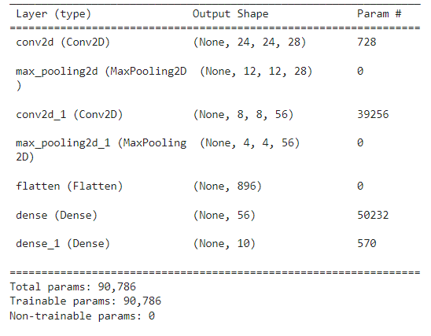
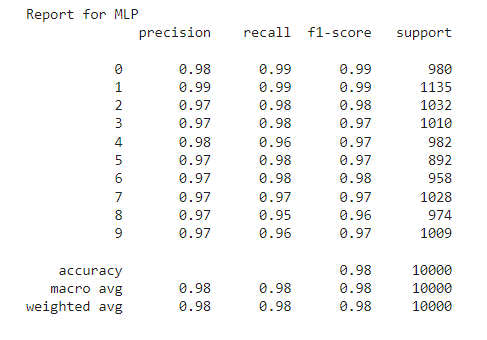
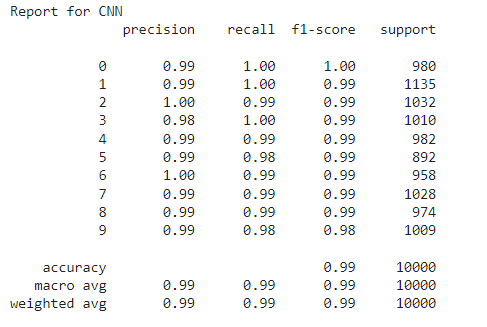
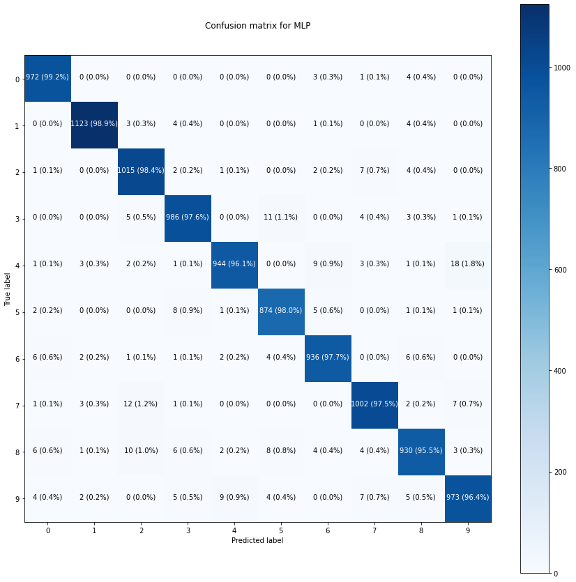

# Q3

## Analysis of MLP & CNN

MLP           |  CNN
:-------------------------:|:-------------------------:
  |  
  |  

### Results

-  We can observe that the number of trainable paramaeters in MLP and CNN are almost eqaul. In CNN most of the parameters are contributed from the dense layers. 

-  From the prediction results obatined we see that the CNN performs slightly better by 0.01 then MLP. We have also calculated various metrics to show prediction results.

## Confusion Matrix

### 1. MLP

  

### 2. CNN

### 3. Results

- From the above confusion matrix we can clearly see the false predictions and true predictions. i.e. the confusion of the model to predict the ground truth. 